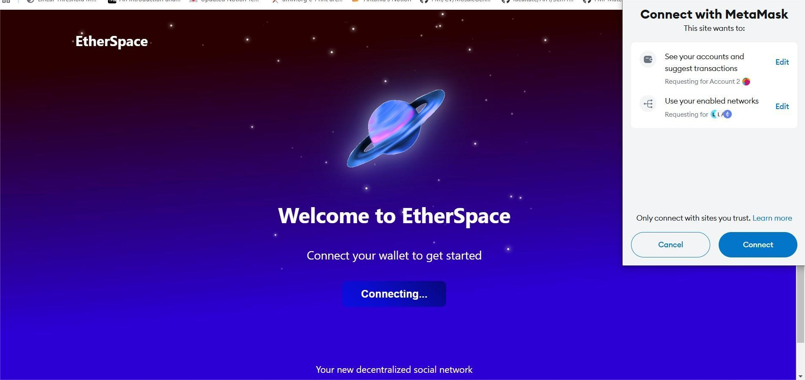

# EtherSpace 🌌🚀

## Overview
EtherSpace is a decentralized social networking platform built on the Ethereum blockchain, designed to provide users with true ownership of their data, content, and digital identity.

## 🌟 Features
### Decentralized Social Networking
- Blockchain-powered user profiles
- Transparent and secure content
- ETH transfer tipping system
- User-owned data
- Decentralized IPFS Profile Picture Storage

### Key Functionalities
- User Profile Creation&Editing
- Content Posting
- User Search
- Wallet Integration
- Tipping creators on their content
- IPFS Profile Picture Upload

## 🛠 Tech Stack
### Frontend
- React.js
- React Router
- Ethers.js
- Tailwind CSS

### Blockchain & Decentralized Storage
- Ethereum
- Solidity Smart Contracts
- Web3 Integration
- IPFS (InterPlanetary File System)
- Pinata Cloud

### Development Tools
- Hardhat
- MetaMask
- Pinata

## 🖼️ Decentralized Profile Picture Storage

### Why IPFS?
EtherSpace uses IPFS (InterPlanetary File System) for profile picture storage to ensure:
- Permanent and immutable file hosting
- Decentralized file storage

### Upload Process
1. User selects profile picture
2. File is prepared
3. Uploaded to IPFS via Pinata
4. IPFS hash stored on Ethereum blockchain
5. Profile picture retrieved using IPFS hash

## ⚡ Gas Cost Analysis
### Profile Operations
- Profile Creation: 141,443 - 141,695 gas
- Profile Update: ~38,625 gas

### Post Operations
- Short Post (6 chars): 208,393 gas
- Medium Post (140 chars): 241,110 gas
- Max Length Post (280 chars): 333,451 gas
- Post Update: ~36,352 gas
- Post Deletion: ~26,349 gas

### Transaction Operations
- Deposits: 28,170 - 45,270 gas
- Transfers: ~47,937 gas
- Withdrawals: ~35,698 gas
- Post Tipping: 40,367 - 74,567 gas

### Contract Deployment
- EtherSpaceProfile: 1,184,089 gas (3.9% limit)
- EthTransfer: 756,878 gas (2.5% limit)
- PostContract: 1,966,591 gas (6.6% limit)
